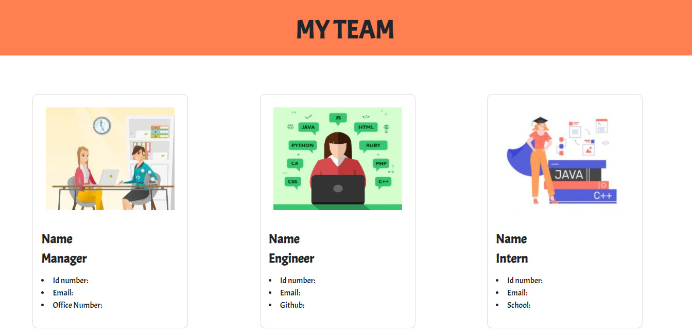

# Team Profile Generator

## Description
The aim of this project is to create a command-line application that generates an HTML file containing a Manager's information and the information for all of their engineer's and intern's. To view the walkthrought video of how this works, please click [here](https://drive.google.com/file/d/1VIvRP19Aq-c6_WWmQrX9ATAA4zdP-L_C/view). 

## Table of Contents 

* [Installation](#installation)
* [Usage](#usage)
* [License](#License)
* [Contributing](#contributing)
* [Test](#test)
* [Questions](#questions)

## Installation
The technologies used for this project include JavaScript, Node.js, package.json with the inquirer dependancy, HTML and CSS.. Please install Node.js to use this application. 

## Usage
The following image is an example of the rendered html file: 

## License 
Permission is hereby granted, free of charge, to any person obtaining a copy of this software and associated documentation files(the "Software"), to deal in the Software without restriction, including without limitation the rights to use, copy, modify, merge, publish, distribute, sublicense, and / or sell copies of the Software, and to permit persons to whom the Software is furnished to do so, subject to the following conditions: The above copyright notice and this permission notice shall be included in all copies or substantial portions of the Software. THE SOFTWARE IS PROVIDED "AS IS", WITHOUT WARRANTY OF ANY KIND, EXPRESS OR IMPLIED, INCLUDING BUT NOT LIMITED TO THE WARRANTIES OF MERCHANTABILITY, FITNESS FOR A PARTICULAR PURPOSE AND NONINFRINGEMENT.IN NO EVENT SHALL THE AUTHORS OR COPYRIGHT HOLDERS BE LIABLE FOR ANY CLAIM, DAMAGES OR OTHER LIABILITY, WHETHER IN AN ACTION OF CONTRACT, TORT OR OTHERWISE, ARISING FROM, OUT OF OR IN CONNECTION WITH THE SOFTWARE OR THE USE OR OTHER DEALINGS IN THE SOFTWARE.

## Contributing
NA

## Test
To run the tests provided, enter "npm run test" into the command line.

## Questions
If you have any questions or would like further information on this project, 
please contact silviataliana2@gmail.com or find me on [Github](https://github.com/silvia-taliana).
